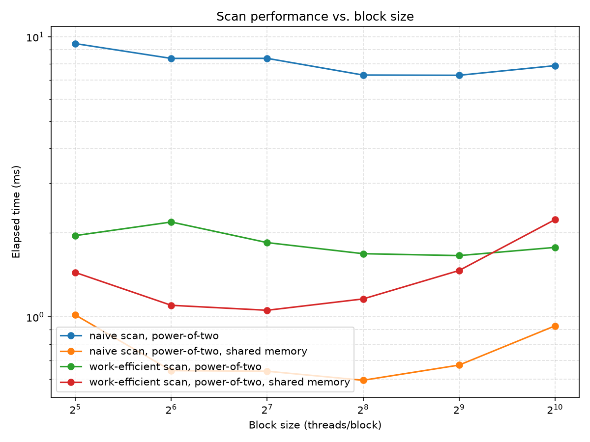
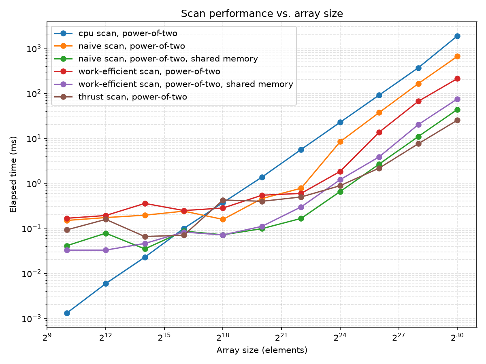
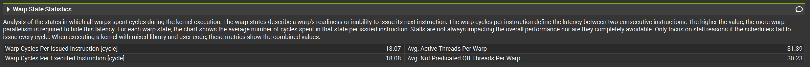
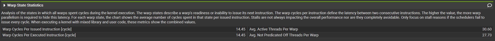
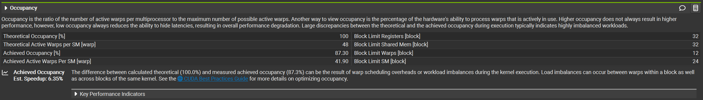
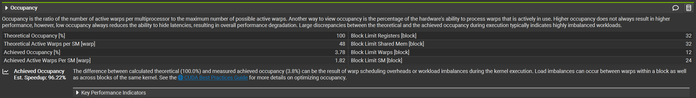

CUDA Stream Compaction
======================

**University of Pennsylvania, CIS 565: GPU Programming and Architecture, Project 2**

* Stephen Gavin Sears
  * [LinkedIn](https://www.linkedin.com/in/gavin-sears-536a1b285), [personal website](https://gavin-sears.github.io/sgavinsears/index.html)
* Tested on: Windows 11, i9-14900HX @ 2.20GHz 32GB, RTX 4090 Laptop 16GB, Compute Capability 8.9 (Personal Computer)

## Features

- CPU scan/compact, including compact with and without scan
- Naive (Hillis-Steele) GPU scan/compact, with and without shared memory
- Blelloch (work-efficient) GPU scan/compact, with and without shared memory
- Thrust scan for comparison
- Bank-conflict-free shared memory access for the shared memory versions

## Performance Analysis

### Block Size Optimization



This was run at a fixed array size of 2^24 elements, varying block size from 32-1024 for each GPU version.

Best block size per approach:
- naive: 256-512
- naive w/ shared memory: 128 
- work-efficient: 512
- work-efficient w/ shared memory: 128 

Block size of 1024 performed the worst because most of these methods are likely hitting the resident thread capacity. The shared memory methods perform even worse relative to the others at 1024 (shared memory approaches rise around 45% and 73% for naive and work efficient respectively, whereas the global memory methods rise less than 10%). This is likely due to the shared memory scaling up with the block size, which then hits the SM's shared memory limit, as well as the resident thread limit.

### Scan Implementation Comparison



This run used block size 128, array sizes from 2^10 - 2^30 (log scaled axis). 

### Why Is My GPU Approach So Slow?

For lower values of n, the CPU approach was faster because of the lower overhead (CPU approach uses a single for loop, whereas the GPU implementations are calling a bunch of kernels and recursing upon themselves, etc.). However, around between 2^15 and 2^18 you can see the CPU version start to get beaten by the GPU approaches.

The CPU version is O(n) time complexity. The naive approach is O(n * log_2(n)), and the work efficient method is O(n) (actually 2 * n, which adds to that overhead cost I mentioned before). This would imply that the CPU approach is comparable in speed, except that the GPU spreads the runtime cost across a large number of threads. Because of this, the GPU algorithms scale better at higher values of n.

Now, for non-shared memory GPU approaches (look at orange and red), the work efficient approach outperformed the naive approach. This was not always so. I previously had lower performance for work efficient, and this had to do with thread occupancy. While my work efficient method was functioning correctly, I was assigning a number of blocks that corresponded to n threads for each loop of the upsweep and downsweep. There was still less total work in the work efficient version, but there were tons of wasted threads that were just checking if they were active or not (and they weren't). Both methods were likely using the same number of threads, but the work efficient version was wasting many of them. Once I started launching kernels that had a number of threads equal to the number of elements I would be changing at each iteration of the up/downsweep loop, then the work efficient version became better.

The shared memory approaches (purple and green) had a relationship that was different than I thought. For lower values, the work efficient method would sometimes beat the naive one. But for higher values, naive actually performed quite a bit better, being the fastest of my implementations. I think this likely happened because of the large number of `__syncthreads()` calls in the shared memory version of the algorithm. In the naive version, we have one loop that goes log_2(n) times, with a `__syncthreads()` in each. In the work efficient method, we have two loops that iterate log_2(n) times, each with a `__syncthreads()` inside. This means that the work efficient version will have roughly double of this type of latency compared to the naive version, which is why I think it performed worse. 

Lastly, nothing outperformed Thrust at very high values of n, and while part of it had to do with my work efficient shared memory version not being as fast as it could be, I would also imagine that there is some lower level aspect to their implementation that makes it more efficient overall.

### Performance Bottleneck Analysis

None of these implementations are compute-bound, since the actual per-element work is integer addition. Below the CPU/GPU crossover (see above), the bottleneck is fixed launch/memcpy overhead. Above it, the global-memory versions are bottlenecked by kernel-launch count and repeated DRAM round-trips per level, while the shared-memory versions trade that for `__syncthreads()` latency instead.

Naive:


Work efficient:


Nsight Compute's Compute Workload Analysis shows work-efficient-shared has a lower average of active threads per warp than naive-shared. This matches the algorithms' structure: naive is always fully active, while work-efficient's up-sweep/down-sweep only has a smaller number of active threads do anything per level, shrinking sharply at deeper levels. The work efficient version's lower warp cycles per issued instruction reflects that  much of its instruction stream is spent in these low-activity deep levels rather than active work. This is another reason, combined with double the `__syncthreads()` barriers, that work efficient shared memory version performed worse.

Earlier launch:


Later launch:


Comparing an early upSweepCompact launch against a late one confirms the occupancy issue from "Why Is My GPU Approach So Slow?": the early launch achieves much higher achieved occupancy, while the late launch has a very low occupancy.

### Test Program Output

- n = 2^20 (1048576) elements
- blockSize = 128 threads
- built in Release mode

```
****************
** SCAN TESTS **
****************
    [  35  37  45  40  13  22  18  34  49  15  29  10   9 ...   5   0 ]
==== cpu scan, power-of-two ====
   elapsed time: 1.5368ms    (std::chrono Measured)
==== cpu scan, non-power-of-two ====
   elapsed time: 1.4751ms    (std::chrono Measured)
    passed
==== naive scan, power-of-two ====
   elapsed time: 0.269312ms    (CUDA Measured)
    passed
==== naive scan, non-power-of-two ====
   elapsed time: 0.202752ms    (CUDA Measured)
    passed
==== naive scan, power-of-two, shared memory ====
   elapsed time: 0.171872ms    (CUDA Measured)
    passed
==== naive scan, non-power-of-two, shared memory ====
   elapsed time: 0.61696ms    (CUDA Measured)
    passed
==== work-efficient scan, power-of-two ====
   elapsed time: 1.63446ms    (CUDA Measured)
    passed
==== work-efficient scan, non-power-of-two ====
   elapsed time: 0.411648ms    (CUDA Measured)
    passed
==== work-efficient scan, power-of-two, shared memory ====
   elapsed time: 0.212128ms    (CUDA Measured)
    passed
==== work-efficient scan, non-power-of-two, shared memory ====
   elapsed time: 0.105568ms    (CUDA Measured)
    passed
==== thrust scan, power-of-two ====
   elapsed time: 0.387072ms    (CUDA Measured)
    passed
==== thrust scan, non-power-of-two ====
   elapsed time: 0.34304ms    (CUDA Measured)
    passed

*****************************
** STREAM COMPACTION TESTS **
*****************************
    [   1   3   3   2   3   0   0   2   3   1   3   2   3 ...   1   0 ]
==== cpu compact without scan, power-of-two ====
   elapsed time: 2.2838ms    (std::chrono Measured)
    passed
==== cpu compact without scan, non-power-of-two ====
   elapsed time: 1.996ms    (std::chrono Measured)
    passed
==== cpu compact with scan ====
   elapsed time: 4.5537ms    (std::chrono Measured)
    passed
==== work-efficient compact, power-of-two ====
   elapsed time: 0.609568ms    (CUDA Measured)
    passed
==== work-efficient compact, non-power-of-two ====
   elapsed time: 0.29696ms    (CUDA Measured)
    passed
```

## Extra Credit

### Shared Memory Scan (Naive and Work-Efficient)

So, global memory access is slow, and every read/write from a kernel has to go all the way out to DRAM unless it was already in the L1 cache, which we can't control. The solution to this is using shared memory.

Shared memory is similar to L1 in that it resides on each streaming multiprocessor. However, unlike the L1 cache, we can control what memory goes there. 

If we want to make use of it in the scan algorithm, each block loads

- the kernel fetches contiguous array items into shared memory
- all threads in block use on chip memory (faster)
- we need to use __syncthreads() now, since we are reading and writing (not in place) from shared mem

However, this approach introduces new problems...

Shared memory declared inside a kernel is strictly private to the block that allocates it. This means that each block of threads can only have access to its own local subset of data, and not the entire array.

As it turns out, the solution to this is a small (if kind of awkward) tweak to the algorithm.

Instead of scanning over the entire data set, we instead have each block do their own local scan, and record the total of all elements in that scan into a total-per-block array. These totals can then be added to the scans from blocks ahead of them in the array! However, each block actually needs the sum of all previous blocks to be added to its scan, so how do we get that? By doign a scan on the totals themselves, of course! The only problem with this is that doing the scan on the block totals has the same problem as with the original array, being that if there are more block totals to scan than threads in a block, we will need to split up our scan again, and record the totals of those to get offsets. The solution to THIS problem is to recursivly call the host side function that launches the scan kernel, so that it will run again on the block totals, before adding the block offsets. Because each recursion will divide the array length by the block size, we will eventually reach a point where n is small enough. At this point the block offsets cascade down and get added at each level of recursion, and eventually we will have the correct block offsets for the final output array.

One last thing to mention is that I included conflict-free memory access. Shared memory is segmented into 32 different banks that can each do one access in parallel. Basically, if your address mod (%) 32 equals another address's mod 32, the access will be slower, because both addresses live in the same bank and have to be serviced one at a time instead of together. In the shared memory approach, loops like the upsweep access memory with strides that are powers of two, and as you probably know, 32 is a power of two (2^5), so at deeper levels, many threads' addresses land on the same bank. The solution here is that we take the index accessing shared memory, divide it by 32 (rounding down), and add that as an offset to the index, which staggers things enough to break up the alignment. We also make our shared memory allocation larger by that same amount, so the padded indices don't go out of bounds.

If you want to check out how the shared memory version performed, look at the section above with my scan performance vs array size chart!